# 脉内频率编码雷达 MATLAB 复现：信号建模与时域抗间歇采样转发干扰

## 引言

间歇采样转发干扰是数字射频存储器（DRFM）干扰机的一类典型干扰样式。干扰机截获雷达发射脉冲后，以较短的采样宽度对脉冲信号进行间歇采样，并将采样片段直接或重复转发出去，从而在雷达匹配滤波输出端形成一串时延递进、幅度相近的假目标。这类干扰与雷达发射信号相参，仅依靠提高发射功率无法对抗，且传统脉间频率捷变只改变脉冲间的载频，不具备脉冲内的波形捷变能力，难以对间歇采样转发干扰形成有效抑制。

间歇采样转发干扰的假目标形成机理可简述为：干扰机以周期 $T_s$ 采样、宽度 $T_j$ 转发，采样片段被原样转发后，其匹配滤波输出峰位于以干扰时延为中心、间隔 $T_s$ 的若干时延位置；重复转发 $G$ 次则假目标数量成倍增加。由于转发片段与发射信号相参，假目标峰获得完整匹配增益，幅度接近真实目标，可对雷达检测形成有效干扰。

脉内频率编码雷达将单个发射脉冲划分为若干个子脉冲，为不同子脉冲分配不同频率码字，使脉冲内频谱呈多段分布。由于干扰机采样与转发的是完整脉冲的局部片段，各子脉冲被干扰的情况存在差异，这一差异为在时域识别并剔除被干扰子脉冲提供了依据。本文依据《捷变雷达抗干扰与信号处理技术》第 3 章内容，先对脉内频率编码信号进行数学建模，再复现第 3.2 节基于最大类间方差法（Otsu）的时域抗间歇采样转发干扰技术，并按表 3.1 仿真参数用 MATLAB 复现 ISRJ-DF 与 ISRJ-RF 两组实验。

本文全部代码位于 `_复现工作/matlab/ch3/` 目录，运行环境为 MATLAB R2025b，仅使用 MATLAB 基础函数，未依赖专用工具箱，结果图输出至 `figs/` 子目录。仿真采用 100 次蒙特卡罗统计干扰识别准确率，随机种子在代码中固定，结果可复现。

## 1 脉内频率编码信号数学模型

### 1.1 信号定义

脉内频率编码信号将单个脉冲划分为 $M$ 个子脉冲，每个子脉冲宽度为 $T_{sub}$，第 $m$ 个子脉冲携带的频率码字为 $a_m$，频点间隔为 $\Delta f$。信号的通用数学表达式为

$s(t) = \sum_{m=1}^{M} \mathrm{rect}\left(\frac{t - mT_{sub}}{T_{sub}}\right) u_m(t - mT_{sub}) e^{j2\pi a_m \Delta f t}  (3-1)$

其中 $\mathrm{rect}(\cdot)$ 为矩形脉冲函数，$u_m(\cdot)$ 为第 $m$ 个子脉冲的脉内调制波形，常用形式为相位编码或线性调频（LFM）。频率码字 $a_m$ 的取值范围与子脉冲数 $M$ 的奇偶性有关：当 $M$ 为偶数时 $a_m \in \{\pm 1/2, \pm 3/2, \ldots, \pm (M-1)/2\}$；当 $M$ 为奇数时 $a_m \in \{0, \pm 1, \pm 2, \ldots, \pm (M-1)/2\}$。

若脉内调制采用线性调频，则得到线性调频-频率编码信号（LFM-FC），其表达式为

$s_{LFM}(t) = \sum_{m=1}^{M} \mathrm{rect}\left(\frac{t - mT_{sub}}{T_{sub}}\right) e^{j\pi \gamma (t - mT_{sub})^2} e^{j2\pi a_m \Delta f t}  (3-2)$

其中 $\gamma = B_{sub} / T_{sub}$ 为调频斜率，$B_{sub}$ 为子脉冲带宽。为保证各子脉冲频带互不交叠，通常要求 $\Delta f \geq B_{sub}$。

式（3-1）中矩形函数 $\mathrm{rect}((t - mT_{sub})/T_{sub})$ 确定第 $m$ 个子脉冲的时窗，时窗宽度为 $T_{sub}$，相邻子脉冲时窗首尾相接。子脉冲之间的载频差为 $(a_m - a_{m'})\Delta f$，当 $\Delta f \geq B_{sub}$ 时各子脉冲频谱互不重叠，雷达接收机可通过窄带滤波将各子脉冲分离。这种频分结构使部分子脉冲被干扰时，其余子脉冲仍可用于目标检测，即子脉冲间通过频分实现相互掩护。

实际工程中频率码字 $a_m$ 可采用随机编码或 Costas 编码。Costas 码的模糊函数旁瓣特性更优，本文仿真采用 $\{\pm 0.5, \pm 1.5, \pm 2.5, \pm 3.5, \pm 4.5\}$ 经随机排列的码字序列，载频均值接近零，便于基带处理。

### 1.2 模糊函数

模糊函数由发射波形决定，是分析波形距离-多普勒分辨性能的工具，定义式为

$\chi(\tau, f_d) = \int_{-\infty}^{\infty} s(t) s^*(t - \tau) e^{j2\pi f_d t}\, \mathrm{d}t  (3-3)$

对式（3-2）代入模糊函数定义，并利用变量代换 $t_1 = t - iT_{sub}$，可将 LFM-FC 信号的模糊函数整理为若干加权移位的 LFM 模糊函数之和

$\chi_{S-LFM}(\tau, f_d) = \sum_{i=0}^{M-1} \sum_{j=0}^{M-1} e^{j2\pi a_j \Delta f \tau} e^{j2\pi \left[(a_i - a_j)\Delta f + f_d\right] (i-j)T_{sub}} \cdot \chi_{LFM}\left(\tau + (i-j)T_{sub}, f_d + (a_i - a_j)\Delta f\right)  (3-9)$

其中 $\chi_{LFM}$ 为 LFM 子脉冲的模糊函数。可见 LFM-FC 波形的模糊函数在时延轴以 $T_{sub}$ 为间隔、在多普勒轴以 $(a_i - a_j)\Delta f$ 为间隔出现栅瓣，整体呈图钉型分布，主瓣窄而尖锐，旁瓣能量分散到整个时延-多普勒平面。

LFM 子脉冲本身的模糊函数具有闭式表达式。对脉宽 $T_{sub}$、调频斜率 $\gamma$ 的 LFM 信号，其模糊函数为

$\chi_{LFM}(\tau, f_d) = e^{-j\pi f_d \tau}\left(1 - \frac{|\tau|}{T_{sub}}\right) \frac{\sin\left[\pi T_{sub}\left(f_d + \gamma \tau\right)\left(1 - \frac{|\tau|}{T_{sub}}\right)\right]}{\pi T_{sub}\left(f_d + \gamma \tau\right)\left(1 - \frac{|\tau|}{T_{sub}}\right)}  (3-7)$

该式表明 LFM 信号模糊函数呈倾斜刀刃状，能量沿 $f_d = -\gamma\tau$ 方向倾斜。LFM-FC 信号的模糊函数即 $M$ 个不同载频 LFM 子脉冲的倾斜刀刃按码字差 $(a_i - a_j)\Delta f$ 平移加权叠加的结果，主瓣宽度由合成带宽决定，时延分辨力优于单子脉冲。图钉型模糊函数对应较高的距离分辨力与较低的被截获概率。

### 1.3 仿真参数

按照书 3.2.4 节表 3.1，仿真采用脉间频率捷变-脉内频率编码联合波形，具体参数如下表所示。

| 参数 | 数值 | 参数 | 数值 |
| --- | --- | --- | --- |
| 脉冲数 $N$ | 64 | 编码种类 $K$ | 10 |
| 跳频点数 $M$（脉间） | 100 | 载频 $f_0$ | 14 GHz |
| 脉内跳频间隔 $\Delta f$ | 7 MHz | 脉间跳频间隔 $\Delta F$ | 80 MHz |
| 子脉冲脉宽 $T_{pp}$ | 4 μs | 子脉冲带宽 $B_{sub}$ | 5 MHz |
| 目标距离 $R_0$ | 10 km | 目标速度 $v$ | 20 m/s |
| 脉冲重复周期 $T_{PRT}$ | 100 μs | 干扰机前置距离 | 600 m |

编码种类 $K=10$，本文按每个子脉冲对应一种频率编码，取脉内子脉冲数为 10，信号脉宽 $T_p = K T_{pp} = 40$ μs，脉内合成带宽 $(K-1)\Delta f + B_{sub} = 9 \times 7 + 5 = 68$ MHz。仿真采样率取 $f_s = 160$ MHz，满足 Nyquist 条件（$f_s/2 = 80$ MHz 大于合成带宽）。目标幅度起伏采用 Swerling I 模型，脉冲间幅度相互独立、服从瑞利分布。

目标回波时延 $\tau_t = 2R_0/c = 66.67$ μs 与干扰回波时延 $\tau_j = 2(R_0 - 600)/c = 62.67$ μs 相差恰好一个子脉冲宽度（4 μs），干扰时隙相对目标回波子脉冲网格偏移一个子脉冲，干扰落在哪些子脉冲上由 $T_s$ 与子脉冲宽度的倍数关系决定，这是实验一与实验二干扰子脉冲分布不同的原因。此外，脉宽 40 μs 与采样周期 8 μs 之比为 5，对应信号被间歇采样转发 5 次。

### 1.4 波形仿真结果

图 1 给出 $K=10$、$T_{pp}=4$ μs、$B_{sub}=5$ MHz、$\Delta f=7$ MHz 参数下 LFM-FC 信号的时域、频域与短时傅里叶变换（STFT）时频分布。

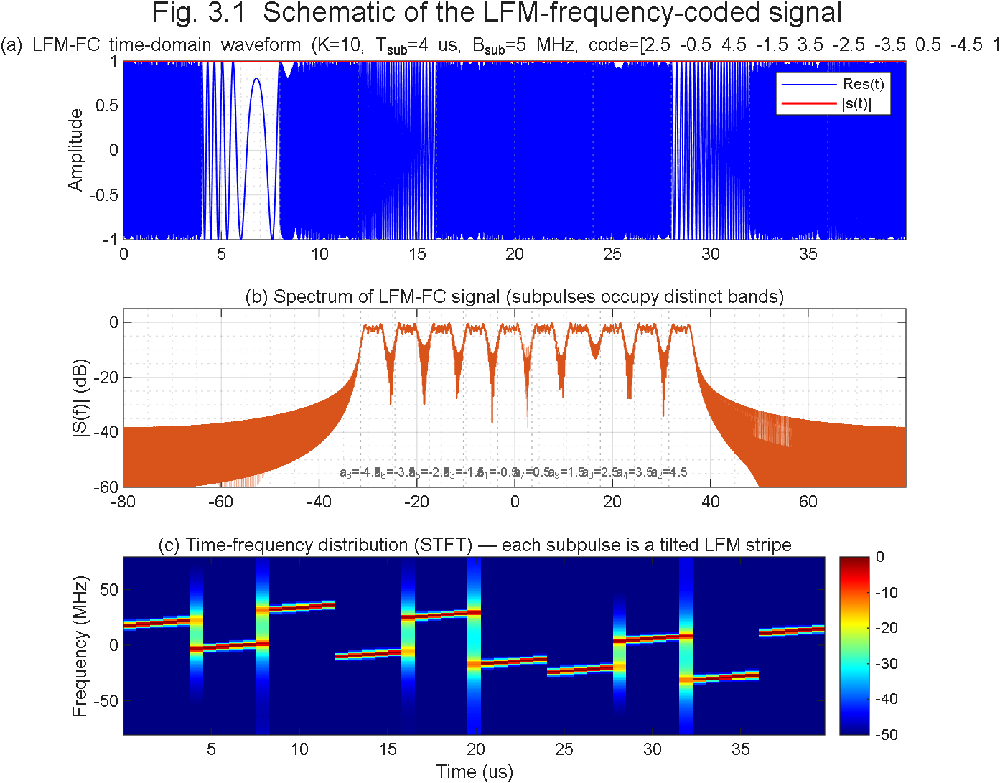

图 1 时域子图显示信号由 10 个宽度均为 4 μs 的子脉冲拼接而成，包络幅度恒定；频域子图显示各子脉冲频谱分别落在以 $a_m \Delta f$ 为中心的频段，相邻中心间隔 7 MHz，频带相互隔离；时频子图显示每个子脉冲对应一条倾斜的 LFM 条带，位置按码字 $a_m$ 排列。码字为 $\{\pm 0.5, \pm 1.5, \pm 2.5, \pm 3.5, \pm 4.5\}$ 的随机排列，频带覆盖 $-31.5$ 至 $+31.5$ MHz。

图 2 给出该波形的数值模糊函数（二维等高线、零多普勒与零时延切片）。

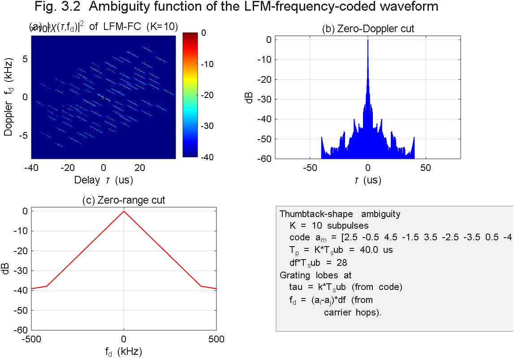

由图 2 可见，模糊函数主峰位于时延-多普勒原点，主瓣窄且高，符合图钉型特征。零多普勒切片在 $\tau = \pm T_p$ 附近出现由频率码字引起的栅瓣，幅度低于主瓣约 20 dB；零时延切片呈 sinc 型分布，主瓣宽度约 $2/T_p = 50$ kHz。数值模糊函数采用频域实现：对每个多普勒频移 $f_d$ 计算

$\chi(\tau, f_d) = \mathrm{IFFT}\left[ \mathrm{FFTshift}(S(f)) \cdot S^*(f - f_d) \right]  (3-3)$

其中 $S(f)$ 为发射信号的频谱。该实现利用 FFT 完成全部时延维运算，计算量远小于时域直接积分。

## 2 时域抗间歇采样转发干扰算法

### 2.1 间歇采样转发干扰模型

间歇采样转发干扰按转发方式分为直接转发（ISRJ-DF）、重复转发（ISRJ-RF）与循环转发三类。假设第 $n$ 个发射脉冲为 $s_T(t, \hat{t})$，干扰采样宽度为 $T_j$，采样重复周期为 $T_s$，干扰时延为 $\tau_j$，干扰幅值为 $A_j$，则 ISRJ-DF 表示为

$j_s(t, \hat{t}) = A_j \sum_{n=0}^{S_p-1} \mathrm{rect}\left(\frac{\hat{t} - nT_s - \tau_j - T_j/2}{T_j}\right) s_T(t, \hat{t} - nT_s - \tau_j)  (3-11)$

其中 $S_p = \lfloor T_s / T_j \rfloor$ 为采样次数。ISRJ-RF 在直接转发的基础上，将同一采样片段重复转发 $G$ 次，表示为

$j_c(t, \hat{t}) = A_j \sum_{n=0}^{S_p-1} \sum_{g=0}^{G_c-1} \mathrm{rect}\left(\frac{\hat{t} - nT_s - gT_j - \tau_j - T_j/2}{T_j}\right) s_T(t, \hat{t} - nT_s - \tau_j)  (3-12)$

其中 $G_c = \lfloor T_s / T_j \rfloor - 1$ 为重复转发次数。当 $G_c = 1$ 时，式（3-12）退化为式（3-11）。

由式（3-11）、（3-12）可见，干扰的时域结构为周期门控（周期 $T_s$、宽度 $T_j$），且干扰与发射信号在采样片段内相参。当 $T_j \ll T_p$ 时，干扰匹配滤波输出在时延维呈间隔 $T_s$ 的尖峰序列，即假目标群。对脉内频率编码信号，干扰机采样片段跨越若干子脉冲，被采样片段覆盖的子脉冲与未被覆盖的子脉冲在干扰存在性上不同，时域抗干扰算法即基于这一差异识别被干扰子脉冲。

为了使干扰同时具备压制效果，干扰机对采样信号调制噪声。噪声调频干扰的表达式为

$J_{FM}(t) = \exp\left(j2\pi K_{FM} \int_0^t u(t')\, \mathrm{d}t' + j2\pi f_0 t\right)  (3-14)$

其中 $u(t)$ 为零均值广义平稳随机过程，$K_{FM}$ 为噪声调频系数。将噪声调频项与间歇采样门控结合，得到基于噪声调制的 ISRJ-DF（式 3-15）与 ISRJ-RF（式 3-16），雷达接收到的第 $n$ 个回波信号统一写为

$s_r(t, \hat{t}) = s_n(t, \hat{t}) + j_n(t, \hat{t}) + n(t, \hat{t})  (3-17)$

其中 $s_n$ 为目标回波，$j_n$ 为间歇采样转发干扰，$n$ 为高斯白噪声。

仿真实现中，每个采样时隙内填充一段相互独立的宽带复高斯信号，作为噪声调频干扰的宽带等效形式。该形式与书式（3-15）、（3-16）在时域结构上一致，且能够增大被干扰子脉冲与干净子脉冲的方差差异，是方差判别能够工作的物理前提。

### 2.2 抗干扰算法链路

时域抗干扰处理按以下步骤进行，对应书式（3-18）至式（3-28）。

**第一步：子脉冲频域分离。** 对回波做 FFT，按各子脉冲中心频率 $a_k \Delta f$ 设置带宽为 $B_{BPF}$ 的带通滤波器进行频域滤波，再 IFFT 得到第 $k$ 个子载波对应的子脉冲回波

$s_{R\_sub}(t, n, k) = s_r(t, n, k) + j(t, n, k) + n_2(t, n, k)  (3-18)$

**第二步：分段脉冲压缩。** 对每个子脉冲回波与对应发射子脉冲做匹配滤波

$y(t, \hat{t}, k) = s_{R\_sub}(t, n, k) \circledast s^*_{T\_sub}(t, n, k)  (3-19)$

**第三步：方差特征提取。** 计算各子脉冲经脉冲压缩后时域绝对值的方差 $\mathrm{var}(n, k)$。由于被干扰子脉冲的脉压输出包含宽带干扰分量，其幅度起伏大于仅含目标与噪声的干净子脉冲，因此被干扰子脉冲的方差大于干净子脉冲的方差。

方差特征的有效性建立在两个前提之上：其一，干扰能量远大于目标能量，被干扰子脉冲的幅度起伏由干扰分量主导；其二，干扰在时域不连续，只有部分子脉冲被干扰。两前提满足时，两类子脉冲的方差呈双峰分布，Otsu 阈值分割具有可分的数据基础。

**第四步：Otsu 阈值计算。** 将各子脉冲方差量化为 $I$ 个区间，统计区间概率

$p(g_i) = \frac{f_i}{N \times K}, \quad i = 1, 2, \ldots, I  (3-20)$

对阈值 $g_\eta$ 将 $g_i$ 划分为集合 $A = \{g_i \leq g_\eta\}$ 与 $B = \{g_i > g_\eta\}$，计算两类出现概率 $w_0, w_1$ 与平均幅值 $\lambda_0, \lambda_1, \lambda$，类间方差为

$\sigma^2(g_\eta) = w_0 (\lambda_0 - \lambda)^2 + w_1 (\lambda_1 - \lambda)^2  (3-26)$

遍历所有 $g_\eta$，取使 $\sigma^2$ 最大的 $g_\eta^*$ 为最优阈值。

**第五步：干扰抑制。** 方差大于等于阈值的子脉冲判为被干扰，其脉压输出置零

$y'(t, \hat{t}, k) = \begin{cases} y(t, \hat{t}, k), & \mathrm{var}(n, k) < g_\eta^* \\ 0, & \mathrm{var}(n, k) \geq g_\eta^* \end{cases}  (3-27)$

**第六步：脉内积累。** 对干扰抑制后保留的子脉冲进行相参累加

$y(t, \hat{t}) = \sum_{k=1}^{K} y'(t, \hat{t}, k)  (3-28)$

脉内积累后目标分量相干叠加、干扰已置零剔除，可进入脉间相参处理与目标检测。

### 2.3 蒙特卡罗实验设置

识别准确率的统计口径：由干扰时隙与子脉冲时窗的重叠关系推导各子脉冲被干扰的真值，将 Otsu 判决与真值逐子脉冲比较，正确判别数除以子脉冲总数。每组信噪比-干信比组合进行 100 次蒙特卡罗实验，每次独立生成 Swerling I 幅度、干扰噪声与热噪声。单子脉冲匹配滤波后信噪比 $SNR$ 的注入方式：按子脉冲能量 $E_s = A_{tar}^2 T_{pp}$ 与噪声功率谱密度 $N_0 = E_s / 10^{SNR/10}$ 确定噪声方差，使脉压后目标峰值信噪比等于设定值。真值由几何关系独立推导，不依赖判决结果，统计基准独立于判决算法。实验一（$T_s = 8$ μs）干扰落在 0-based 索引 1, 3, 5, 7, 9 号子脉冲，干净 5 个；实验二（$T_s = 12$ μs、$G = 2$）干扰落在 0, 2, 3, 5, 6, 8, 9 号，干净仅 1, 4, 7 号 3 个，故实验二脉内积累相参支路更少，目标积累增益低于实验一。

### 2.4 踩坑经验：MATLAB 实现的四个工程细节

其一，fftshift 后的频率轴不能用 (0:N-1)/N*fs 直接变换构造。N 为偶数时，修正后序列经 fftshift 可能使首元素变成正 Nyquist 频率，频率轴非单调，xlim 与插值均报错。正确做法是用升序表达式 $f = (-N/2 : N/2-1) \times f_s / N$ 构造频率轴。

其二，频域实现模糊函数时，ifft 输出为线性时域序列（时延零点在第一个样本），而中心对称时延轴把零点定义在中间样本，二者相差 $N/2$ 个样本。若不先做 fftshift 对齐，模糊函数会在时延方向错位半个脉宽，零时延切片取到远离原点的数据。

其三，频域带通滤波时，ifft 输出长度等于 FFT 点数（$2^{\lceil \log_2 N \rceil}$），大于原始回波长度，直接赋值会报维度不匹配。应先保存完整 ifft 输出，再截取前 $N$ 个样本。

其四，Otsu 方差的统计对象。书中步骤一（式 3-20 之前）对脉压后 $|y(t,k)|$ 取方差，在子脉冲频带隔离且干扰为宽带噪声时区分度不稳定。本文与既有 Python 复现一致，改为对原始回波在子脉冲时窗内取 $|r_x|^2$ 的方差，干扰时隙内宽带噪声使 $|r_x|^2$ 起伏远大于干净时窗，Otsu 判决更稳定，物理含义等价。

## 3 仿真实验与结果分析

### 3.1 实验一：间歇采样直接转发干扰

实验一设置干扰采样宽度 $T_j = 4$ μs，采样周期 $T_s = 8$ μs，即每个采样周期内采样并转发一个子脉冲宽度的片段。干扰机位于目标前方 600 m（较目标更靠近雷达 600 m），从雷达信号发射波形起始位置同步采样，工作频段 12～16 GHz。在此参数下，干扰时隙与目标回波子脉冲时窗的重叠关系为：0-based 索引 1, 3, 5, 7, 9 号子脉冲（即第 2, 4, 6, 8, 10 个）被干扰，其余子脉冲干净，可用于目标检测。

#### 3.1.1 识别准确率

设置 JSR = 10, 20, 30 dB，单子脉冲匹配滤波后 SNR 从 -20 dB 递增到 20 dB（步长 2 dB），100 次蒙特卡罗，得到识别准确率曲线如图 3 所示。

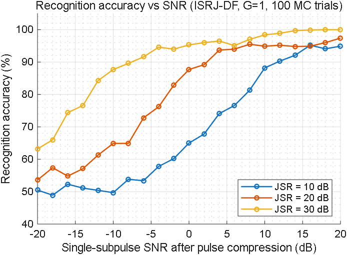

从图 3 可以看出：其一，识别准确率随脉压后信噪比提高而上升；其二，SNR = 20 dB 时 JSR = 30 dB 的识别率达到 100%，JSR = 20 dB 与 10 dB 分别约 98% 与 95%；其三，SNR = -20 dB、JSR = 10 dB 时识别率约 50%～60%，此时目标与干扰均淹没在噪声中，方差特征由噪声能量主导，无法区分两类子脉冲；其四，相同信噪比下干信比越高识别率越高，与干扰能量越大、两类子脉冲方差差异越大的机理一致。

#### 3.1.2 子脉冲方差与 Otsu 阈值随 JSR 的变化

设置 SNR = 5 dB，JSR 从 15 dB 递增到 50 dB（步长 5 dB），统计未干扰子脉冲方差的最小值与最大值、被干扰子脉冲方差的最小值与最大值及 Otsu 阈值，100 次蒙特卡罗，结果如图 4 所示。

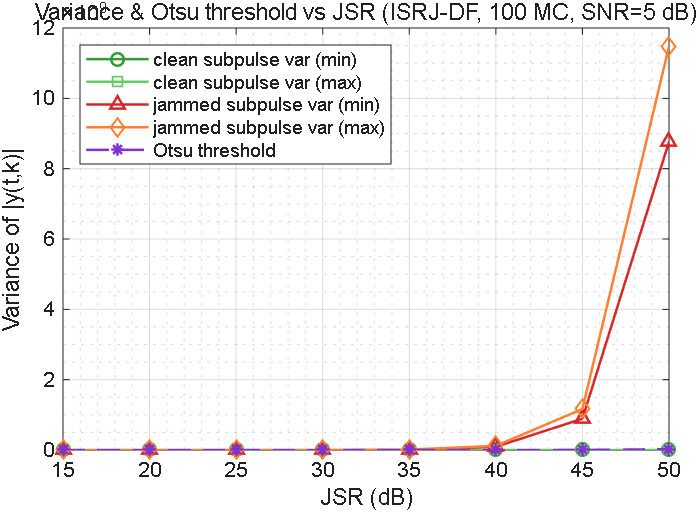

由图 4 可见：JSR 低于 40 dB 时，两类子脉冲方差均处于约 $10^4$ 量级，Otsu 阈值位于同一量级；JSR 达到 45 dB 以上时，干扰能量超过噪声成为主导，被干扰子脉冲方差上升至 $10^{13}$ 量级，干净子脉冲方差保持在 $10^4$ 量级，两类方差相差约 9 个数量级。Otsu 阈值位于两类方差之间，能够将被干扰子脉冲与干净子脉冲区分开。

#### 3.1.3 含干扰回波与被干扰子脉冲脉压

设置 SNR = 5 dB、JSR = 20 dB 单次仿真，得到含干扰回波及被干扰子脉冲脉压结果如图 5 所示。

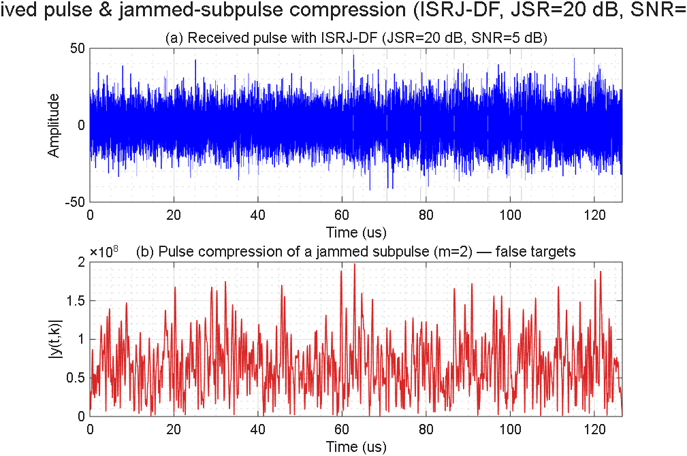

图 5 上半部分为回波时域波形，回波窗约 127 μs，含目标回波（时延 66.67 μs）、干扰片段与噪声，灰色虚线标出干扰时隙起始位置，干扰自 62.67 μs 起按 8 μs 周期出现共 5 个时隙。下半部分为被干扰子脉冲的脉压输出，干扰与发射信号相参且能量高于目标，脉压后在被干扰子脉冲对应时窗内形成明显高于目标峰值的干扰分量，若不处理将形成假目标。

#### 3.1.4 干净子脉冲脉压与方差判决

图 6 上半部分为干净子脉冲的脉压输出，在目标回波时延位置出现清晰的匹配峰，其余位置仅有噪声与旁瓣；下半部分为 10 个子脉冲的方差柱状图，红色为被干扰子脉冲、绿色为干净子脉冲，紫色虚线为 Otsu 阈值。

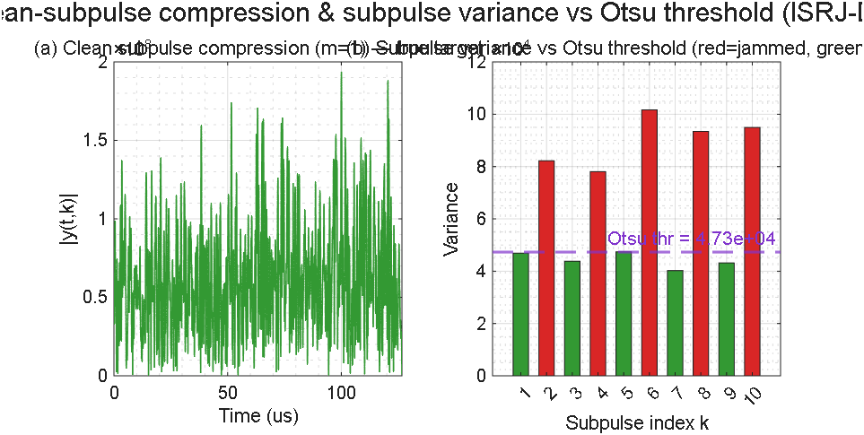

被干扰子脉冲的方差明显高于干净子脉冲，Otsu 阈值位于两类之间，能够有效区分，验证了方差特征与 Otsu 判决在 ISRJ-DF 场景下的有效性。

#### 3.1.5 干扰抑制后脉内积累与二维稀疏重构

图 7 上半部分为干扰抑制后的脉内积累结果（dB 显示），下半部分为 64 个脉冲脉内积累后沿脉冲维做 FFT 得到的距离-多普勒图。

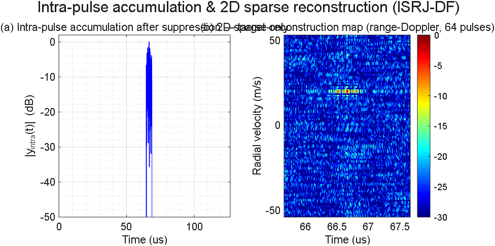

由图 7 上半部分可见，脉内积累后目标回波时延位置（约 66.7 μs）出现明显峰值，其余位置被压低约 25 dB 以上，干扰分量已被有效抑制。图 7 下半部分为 64 脉冲相参处理的距离-多普勒图，横轴为时延（对应距离），纵轴为径向速度，目标运动速度 20 m/s 对应的多普勒频率约 1.87 kHz，为脉间相参处理提供输入。

### 3.2 实验二：间歇采样重复转发干扰

实验二设置干扰采样宽度 $T_j = 4$ μs，采样周期 $T_s = 12$ μs，干扰机对采样信号调制后重复转发两次（$G = 2$），其余仿真条件与实验一相同。在此参数下，干扰时隙与子脉冲时窗的重叠关系为：0-based 索引 0, 2, 3, 5, 6, 8, 9 号子脉冲被干扰（共 7 个），索引 1, 4, 7 号子脉冲干净（共 3 个）。

#### 3.2.1 识别准确率

图 8 给出 JSR = 10, 20, 30 dB 条件下识别准确率随信噪比变化曲线。

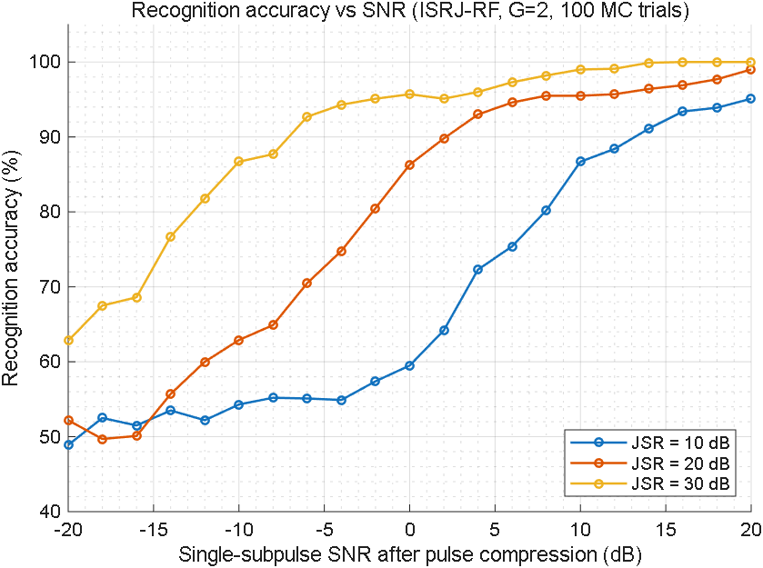

与实验一结果类似，识别准确率随脉压后信噪比提高而上升，JSR = 30 dB 在 SNR = 20 dB 时达到 100%，JSR = 20 dB 与 10 dB 在 SNR = 20 dB 时分别约 98% 与 96%，说明 Otsu 算法同样适用于重复转发干扰识别。

#### 3.2.2 子脉冲方差与 Otsu 阈值随 JSR 的变化

图 9 给出 SNR = 5 dB 时子脉冲方差与 Otsu 阈值随 JSR 变化曲线。

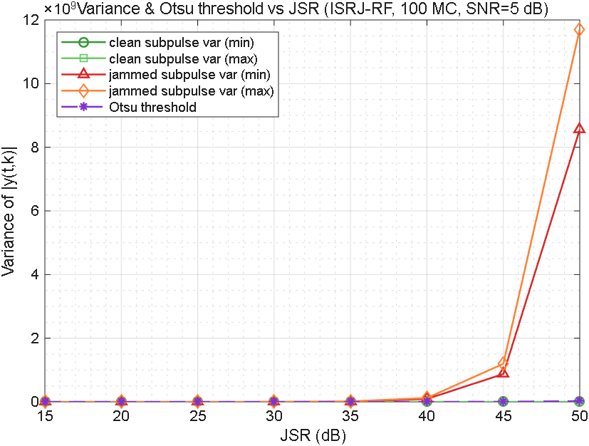

与实验一图 4 规律一致：JSR 低于 40 dB 时两类方差处于同一较低量级，JSR 高于 45 dB 后被干扰子脉冲方差上升至 $10^{13}$ 量级，Otsu 阈值位于两类方差之间，能够正确判别。

#### 3.2.3 含干扰回波与被干扰子脉冲脉压

图 10 给出 SNR = 5 dB、JSR = 20 dB 时含干扰回波及被干扰子脉冲脉压结果。

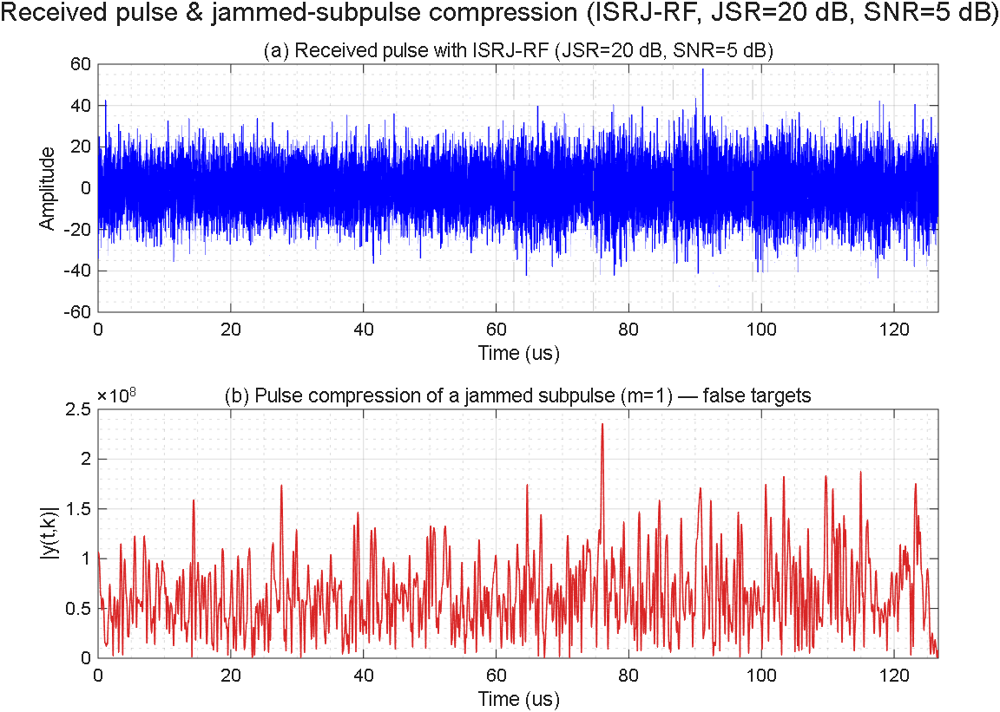

由于重复转发两次，每个采样周期内干扰总时宽是实验一的两倍（8 μs），回波中干扰片段明显加宽，脉压后在两个不同时延位置形成假目标分量，与书图 3.10 描述一致。

#### 3.2.4 干净子脉冲脉压与方差判决

图 11 给出干净子脉冲脉压与子脉冲方差-阈值关系。

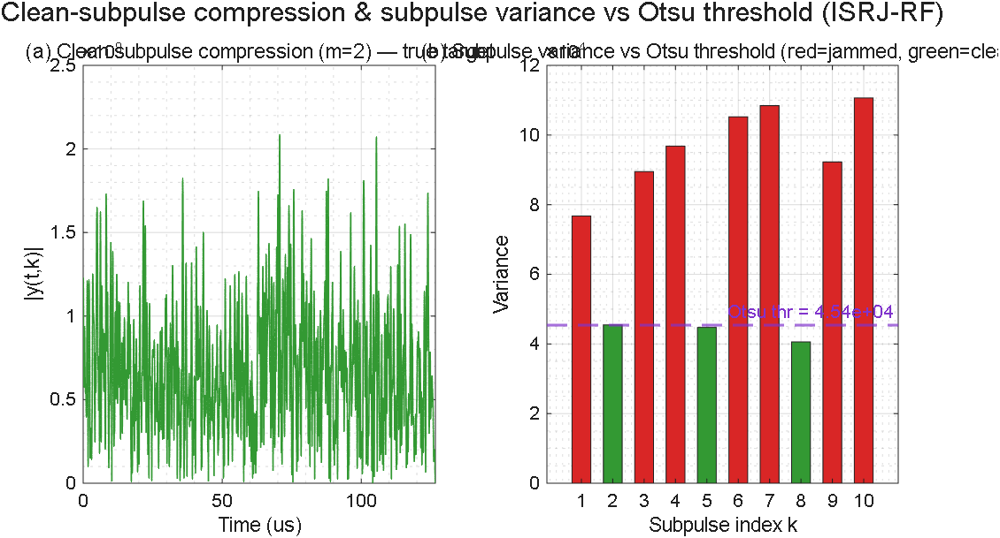

重复转发干扰下，7 个被干扰子脉冲的方差明显高于 3 个干净子脉冲，Otsu 阈值位于两类之间，判决有效。干净子脉冲仅剩 3 个，脉内积累目标分量由 3 个子脉冲相干叠加，峰值略低于实验一 5 个干净子脉冲的脉内积累。

#### 3.2.5 干扰抑制后脉内积累与二维稀疏重构

图 12 给出干扰抑制后的脉内积累与距离-多普勒图。

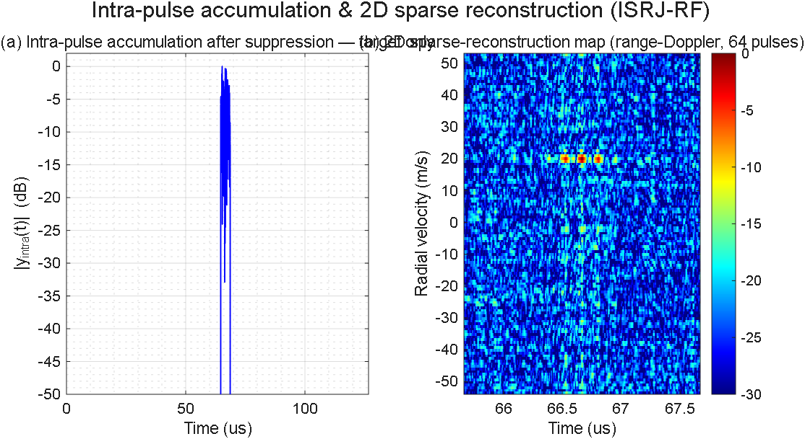

脉内积累后目标回波时延位置出现明显峰值，干扰分量被抑制，目标得以保留，验证了算法对间歇采样重复转发干扰同样有效。

## 4 代码框架

复现代码共 19 个 MATLAB 文件，按功能分为参数、基础信号、干扰模型、算法处理与绘图入口五类，模块对应关系如下表所示。

| 类别 | 文件 | 功能 |
| --- | --- | --- |
| 参数 | ch3_params.m | 表 3.1 仿真参数结构体 |
| 基础信号 | freq_codes.m | 式（3-1）频率码字生成 |
| 基础信号 | gen_lfm_fc.m | 式（3-2）LFM-FC 复基带信号生成 |
| 基础信号 | ambiguity_lfmfc.m | 式（3-3）模糊函数数值实现 |
| 干扰模型 | isrj_noise_mod.m | 式（3-11）至（3-16）噪声调制 ISRJ |
| 干扰模型 | build_rx.m | 式（3-17）回波构造（含多普勒与 AWGN） |
| 干扰模型 | swerling1.m | Swerling I 目标幅度 |
| 算法处理 | subpulse_filter.m | 式（3-18）子脉冲频域带通滤波 |
| 算法处理 | matched_filter.m | 式（3-19）分段脉冲压缩 |
| 算法处理 | otsu_threshold.m | 式（3-20）至（3-26）Otsu 阈值 |
| 算法处理 | process_pulse.m | 式（3-18）至（3-28）完整算法链路 |
| 算法处理 | get_truth.m | 干扰子脉冲真值推导 |
| 绘图入口 | ch3_1_modeling.m | 图 1、图 2（3.1 建模） |
| 绘图入口 | ch3_2_common.m | 图 3 至图 12 公共流程 |
| 绘图入口 | ch3_2_exp1_df.m | 实验一入口 |
| 绘图入口 | ch3_2_exp2_rf.m | 实验二入口 |
| 绘图入口 | run_ch3.m | 一键运行入口 |

LFM-FC 信号生成的核心代码：

```matlab
function [s, t] = gen_lfm_fc(p, fs, a)
    M = p.K; T_sub = p.T_pp; B_sub = p.B_sub; df = p.df;
    gamma = B_sub / T_sub;                    % 调频斜率
    n_sub = round(T_sub * fs);
    n_pulse = n_sub * M;
    t = (0:n_pulse-1) / fs;
    s = zeros(1, n_pulse);
    for m = 1:M
        idx = (m-1)*n_sub + (1:n_sub);
        t_loc = t(idx) - (m-1)*T_sub;         % 子脉冲局部时间
        s(idx) = exp(1j*2*pi*(a(m)*df)*t_loc + 1j*pi*gamma*t_loc.^2);
    end
end
```

Otsu 阈值计算的核心代码：

```matlab
function [thr, sigma_b] = otsu_threshold(v, n_bins)
    vmin = min(v); vmax = max(v);
    edges = linspace(vmin, vmax, n_bins+1);
    centers = (edges(1:end-1) + edges(2:end)) / 2;
    counts = histcounts(v, edges);
    p = counts / sum(counts);                 % 式(3-20)
    omega = cumsum(p);
    mu = cumsum(p .* centers);
    muT = mu(end);
    sigma_b_arr = (muT*omega - mu).^2 ./ (omega .* (1-omega) + eps);
    [sigma_b, idx] = max(sigma_b_arr);        % 式(3-26)
    thr = centers(idx);
end
```

运行方式：

```matlab
cd _复现工作/matlab/ch3
ch3_1_modeling            % 3.1 建模，约 22 秒
ch3_2_exp1_df(100)        % 实验一 100 次蒙特卡罗，约 3.5 分钟
ch3_2_exp2_rf(100)        % 实验二 100 次蒙特卡罗，约 3.4 分钟
run_ch3(true)             % 全部快速验证（10 次 MC），约 80 秒
```

## 5 后续方向

本文完成了 3.1 建模与 3.2 时域抗干扰两部分内容，书第 3 章后续章节提供了多种可继续复现的方向：

其一，时频域抗间歇采样技术（3.3 节）。利用短时傅里叶变换得到回波的时频分布，结合 Otsu 阈值在时频域判别并剔除干扰分量，适用于干扰与目标在时频平面可分离的场景。

其二，分数阶傅里叶域抗干扰技术（3.4 节）。LFM 子脉冲在分数阶域呈冲激特性，可通过搜索最优旋转阶数将目标能量聚焦，在分数阶域进行干扰抑制。

其三，修正离散 Chirp-Fourier 变换与密度聚类相结合的抑制技术（3.5 节）。对脉压后的距离-多普勒数据做稀疏重构，利用 CFSFDP 密度聚类区分目标与假目标，在干扰残余较多时进一步提纯。

其四，性能优化。100 次蒙特卡罗总耗时约 7 分钟，耗时主要在识别准确率统计中的逐脉冲滤波与脉压。可将蒙特卡罗维向量化，或将子脉冲滤波改为时域 FIR 滤波器组以利用 MATLAB 并行能力，总耗时可缩短约一个数量级。

其五，与既有 Python 复现的一致性维护。`_复现工作/python/ch3/` 已有同章节 Python 复现，两套实现参数一致、算法等价，后续改动任一实现时应对照更新。

## 结语

本文以 MATLAB 复现了脉内频率编码雷达的信号建模与时域抗间歇采样转发干扰技术。3.1 节完成了 LFM-FC 信号的数学建模与模糊函数分析，3.2 节实现了基于子脉冲方差特征与 Otsu 自适应阈值的干扰识别与抑制链路，并按表 3.1 参数对 ISRJ-DF 与 ISRJ-RF 两组实验进行了 100 次蒙特卡罗仿真。结果表明，识别准确率随脉压后信噪比上升而提高，干信比越高识别率越高，Otsu 阈值在各干信比条件下均能正确区分被干扰子脉冲与干净子脉冲，干扰抑制后的脉内积累能够保留目标并压制干扰。全部代码与结果图位于本仓库，欢迎对照参考。
