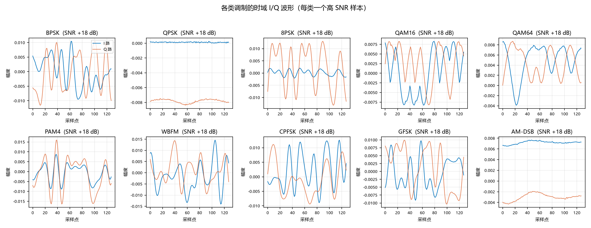
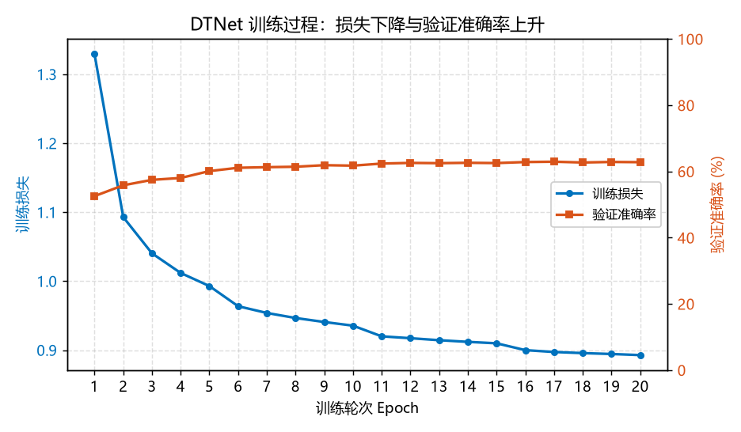
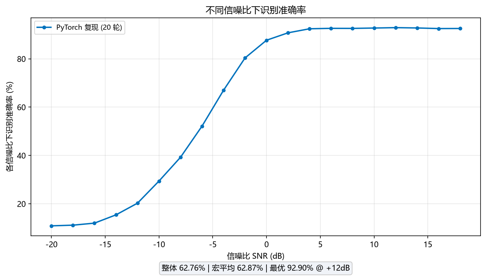
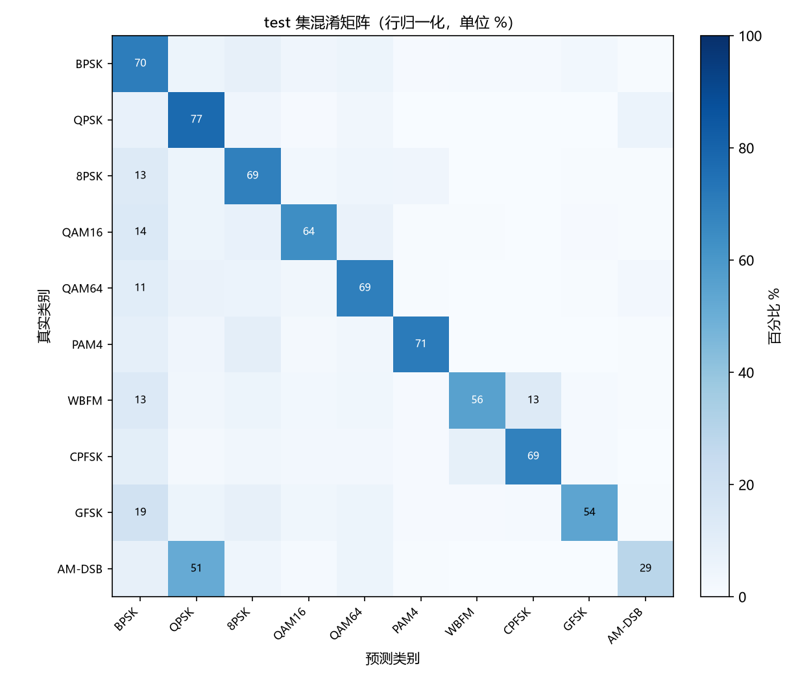

# DTNet 调制识别模型：从 I/Q 样本到 10 类调制的端到端复现

## 0. 本文贡献

- 用信号处理读者能读懂的方式，介绍 DTNet（原论文记作 HSE）在 I/Q 调制识别任务中的主要做法：双流嵌入 + SFE 多尺度扩展 + Transformer 长程建模 + split-MLP 轻量分类头。
- 给出 RML2016.10b 同一数据口径下的 PyTorch 复现结果，并补充三类由代码生成的中文标注图：训练曲线、各类调制时域波形、混淆矩阵。
- 完整训练与评估代码已上传 GitHub：`https://github.com/zhanghzsjtu/MATLAB/tree/main/dtnet-rml2016-pytorch`。

## 1. 背景与问题

自动调制识别（AMR）的任务是：给定一段接收到的复数基带信号，判断它采用了哪种调制方式。

输入是一个长度为 128 的采样序列，每个采样点用两路正交分量表示：

$x \in \mathbb{R}^{128 \times 2}$

其中第一列是同相分量 I，第二列是正交分量 Q。输出是 10 个调制类别之一：BPSK、QPSK、8PSK、QAM16、QAM64、PAM4、WBFM、CPFSK、GFSK、AM-DSB。

传统做法依赖人工设计的特征（如星座图、高阶累积量）；深度学习做法则跳过人工特征，直接从 I/Q 波形中抽取判别信息。DTNet 属于后者，它的核心思路是**同时观察信号的局部片段和更长时段的结构，再统一做分类决策**。

## 2. 数据长什么样

下面这张图从 RML2016.10b 数据集中，为每类调制各抽取了一个高 SNR 样本，画出其 I 路（蓝色）与 Q 路（橙色）随采样点的变化。

从波形上可以直观地区分几类调制：

- **PSK 类（BPSK、QPSK、8PSK）**：包络基本恒定，主要差异在相位变化次数。
- **QAM 类（QAM16、QAM64）**：幅度和相位同时变化，波形兼具调幅与调相特征。
- **PAM4 与 AM-DSB**：以幅度变化为主，包络起伏明显。
- **FM 类（WBFM、CPFSK、GFSK）**：频率变化主导波形形态。

这些差异正是模型可以用来分类的依据。当信噪比降低时，噪声会把这些波形特征淹没，分类难度随之上升。

## 3. DTNet 做了哪几件事

DTNet 的整体结构可以概括为四个步骤。为便于理解，这里只保留输入维度定义，其余步骤用功能描述代替推导。

### 3.1 双流嵌入

输入 $x \in \mathbb{R}^{128 \times 2}$ 被并行地送入两路卷积：

- **支流一（局部）**：用较小的卷积核在原始 I/Q 上滑动，每次只看 16 个连续采样点，提取局部波形特征。
- **支流二（全局）**：先经过一个 SFE 模块把两路原始 I/Q 扩展到 128 通道特征图，再用更大的感受野提取长时段结构。

最后把两支流产出的 token 拼接在一起，加上一个分类用的 CLS token 与位置编码，供后续模块处理。

### 3.2 SFE 模块

SFE（Scale-Feature-Extension）负责把 2 通道原始信号扩展成高维特征图。它包含两条支路：

- **Scale 支路**：用残差卷积 + 幅度门控注意力提取局部尺度特征。
- **Extension 支路**：用深度可分离卷积 + 通道注意力逐步扩展通道数，从 2 通道升到 128 通道。

整个过程中时间维长度保持 128 不变，只是通道维被扩充，以便支流二能从更宽的视角观察信号。

### 3.3 Transformer 编码器与 split-MLP

拼接后的 token 序列送入 4 层 Transformer 编码器。每一层包含：

- **多头自注意力**：在 25 个 token 之间计算关联权重，使每个位置都能看到全局上下文。
- **split-MLP**：把 40 维特征分成两半，各过一个窄前馈网络后再拼接。相比标准前馈，参数量大约减半。

分类时，取最后一层的 CLS token 过一个线性层，输出 10 个类别的分数，再用 softmax 得到概率。

## 4. 实验结果

复现口径：RML2016.10b，10 类，未归一化 I/Q，70/15/15 划分（train 84 万 / val 18 万 / test 18 万）。
PyTorch 训练 20 epoch、batch 2048、AMP，约 14 分钟。

训练损失从第 1 轮的 1.33 单调下降到第 20 轮的 0.89；验证准确率从 52.6% 上升到 62.95%。

| 指标（test 集） | 数值 |
|----------------|------|
| 整体精度 | 62.76% |
| per-SNR 宏平均 | 62.87% |
| 最优单 SNR 精度 | 92.90% @ +12 dB |

随 SNR 升高精度单调上升：低 SNR（−20 dB）约 11%，高 SNR（+12 dB 以上）达 92%+。

混淆矩阵揭示了 10 类之间的主要误判关系：

- AM-DSB 有 51% 的样本被误判为 QPSK，说明这两类在低 SNR 下的波形特征最接近。
- GFSK 有 19% 误判为 BPSK，FM/PSK 类之间的区分在噪声下变得困难。
- WBFM 与 CPFSK 之间也有少量互混。
- PAM4、QAM64 的对角线比例相对较高，说明模型对这两类的识别相对稳定。

## 5. 为什么高 SNR 效果好

高 SNR 下准确率达到 92% 以上，不是模型在高 SNR 时"突然变强"，而是**信号本身更清晰**。

在通信系统中，SNR 定义为信号功率与噪声功率之比：

$\mathrm{SNR} = \frac{P_{\mathrm{signal}}}{P_{\mathrm{noise}}}$

- 当 SNR = −20 dB 时，噪声功率是信号功率的约 100 倍，原始 I/Q 波形几乎被噪声淹没，10 类调制的波形特征严重重叠，模型只能接近随机猜测（约 10%）。
- 当 SNR = +12 dB 时，信号功率远高于噪声，各类调制的 I/Q 结构（相位跳变、幅度层级、频率变化）清晰可分，模型从双流嵌入提取出的局部与全局特征稳定可靠，因此准确率大幅上升。

所以，per-SNR 曲线随 SNR 单调上升是 AMR 任务的典型现象，反映的是**信号被噪声淹没的程度下降**，而非模型结构本身在低 SNR 下失效。

## 6. 复现口径说明

本文复现的 ~62% 整体 / ~92% 高 SNR 水平，与原论文报告的 94.4% 差距来自数据口径：
论文为 11 类、归一化 I/Q、不同验证划分；本文为 10 类、未归一化、70/15/15，属口径差异而非实现错误。

## 7. 收束

- DTNet 通过双流嵌入 + SFE + Transformer，在 I/Q 调制识别上取得 ~62% 整体 / ~92% 高 SNR 的复现精度。
- 训练曲线、per-SNR 准确率图、时域波形图、混淆矩阵均由本仓库脚本基于真实数据生成，便于他人复现与对照。
- 复现代码已开源：`https://github.com/zhanghzsjtu/MATLAB/tree/main/dtnet-rml2016-pytorch`。
