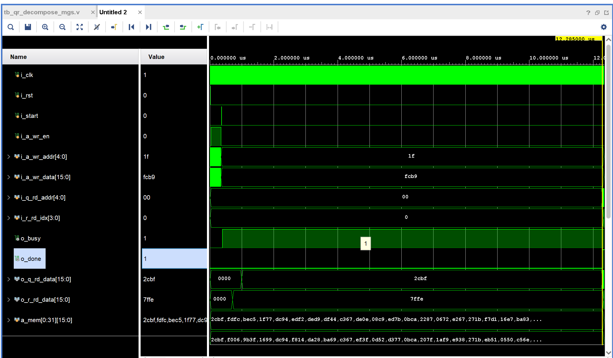

# 基于修正 Gram-Schmidt 的原子支撑集 QR 分解与增量更新（MATLAB 与 Verilog 实现）

## 引言

匹配追踪类算法（OMP 等）逐次从字典中挑选原子，支撑集矩阵每迭代一步就追加一列。若每一步都对当前支撑集矩阵重新做一次完整 QR 分解，计算量随迭代次数线性累积，k 次迭代的总代价接近 $O(mk^3)$。实际实现中常用增量更新：已有 $A_{\text{old}}=Q_{\text{old}}R_{\text{old}}$ 时，新原子只需做一次 Gram-Schmidt 正交化即可并入分解，单步代价降到 $O(mk)$。需要说明的是，QR 分解本身是数值线性代数的通用技术，并不局限于 OMP，最小二乘、线性方程组、特征值迭代等场景都会用到，第 1 章先从原理讲起。本文给出修正 Gram-Schmidt（MGS）QR 分解、面向支撑集扩展的增量更新函数以及完整测试代码，所有 MATLAB 结果在 R2025b 下实测。同时给出对应的 Verilog 状态机实现（Q1.15 定点，MGS 主循环）与 iverilog 仿真结果，便于映射到 FPGA 平台。

## 1 QR 分解的原理：从向量正交化到矩阵分解

QR 分解本身是数值线性代数中的通用工具，与 OMP 并无绑定关系。本节从几何直觉出发，说明 QR 分解是什么、为什么成立、以及它在哪些场景下起作用，不依赖压缩感知背景。

### 1.1 分解的定义与存在性

设 $A$ 是 $m\times k$ 矩阵（$m\ge k$，列满秩），则存在分解

$A = QR$

其中 $Q=[q_1,\dots,q_k]$ 的列两两正交且单位化（$Q^H Q=I_k$），$R$ 是 $k\times k$ 上三角矩阵。若约定 $R$ 对角元为正，则分解唯一。这里的条件 $m\ge k$ 只要求列数不超过行数，不要求方阵——这是 QR 与特征值分解、SVD 的关键差异之一，也是它能用于超定最小二乘的原因。

### 1.2 几何直觉：正交化过程的矩阵写法

把 $A$ 的 $k$ 列看成 $\mathbb{R}^m$ 中的 $k$ 个向量 $a_1,\dots,a_k$。QR 分解做的事情，就是对这组向量依次做 Gram-Schmidt 正交化：

$q_1=\dfrac{a_1}{\|a_1\|},\qquad q_j=\dfrac{a_j-\sum_{i=1}^{j-1}(q_i^H a_j)q_i}{\|a_j-\sum_{i=1}^{j-1}(q_i^H a_j)q_i\|}$

整理后每个原始向量都能写成正交基的线性组合：

$a_j=r_{1j}q_1+r_{2j}q_2+\dots+r_{jj}q_j$

这里出现两个关键结构：

1. $a_j$ 只用前 $j$ 个 $q$ 表示，不涉及 $q_{j+1},\dots,q_k$。把系数排成矩阵 $R$，第 $j$ 列恰有 $j$ 个非零元，第 $j$ 行以下全为零，即 $R$ 上三角。
2. 系数本身有明确几何含义：$r_{ij}=q_i^H a_j$ 是 $a_j$ 在 $q_i$ 方向上的投影系数，$r_{jj}=\|v_j\|$ 是正交化残差的长度。

因此 QR 的几何含义可以概括为：把一组斜交的坐标轴（$A$ 的列）换成一组正交单位坐标轴（$Q$ 的列），$R$ 记录两者之间的坐标变换关系。矩阵 $Q$ 本身可理解为一个旋转/反射（正交变换），$R$ 是变换后的上三角形式。

### 1.3 三个等价视角

- 几何视角。逐列投影、减去投影、归一化，对应第 3 章的完整公式推导。看一个 $3\times 2$ 的数值例子：

$A=\begin{bmatrix} 1 & 1 \\ 1 & -1 \\ 1 & 2 \end{bmatrix}$

先取 $r_{11}=\|a_1\|=\sqrt{3}\approx1.732$，$q_1=(0.577,0.577,0.577)$；再算 $r_{12}=q_1^H a_2\approx1.155$，残差 $v_2=a_2-r_{12}q_1\approx(0.333,-1.667,1.333)$，$r_{22}=\|v_2\|\approx2.160$，$q_2\approx(0.154,-0.772,0.617)$。得到

$R=\begin{bmatrix} 1.732 & 1.155 \\ 0 & 2.160 \end{bmatrix},\qquad Q\approx\begin{bmatrix} 0.577 & 0.154 \\ 0.577 & -0.772 \\ 0.577 & 0.617 \end{bmatrix}$

验证：$q_1 r_{11}=a_1$，$q_1 r_{12}+q_2 r_{22}=a_2$，两列逐项吻合，$R$ 第二行第一列为零。

- 代数视角。$A=QR$ 且 $R$ 可逆（列满秩保证对角元非零），因此 $A$ 的列空间与 $Q$ 的列空间相同：$\text{col}(A)=\text{col}(Q)$。$Q$ 是列空间的一组正交基，$R$ 是从正交基到原始基的坐标变换矩阵。这也说明 QR 本质上是基变换与正交化的复合。

- 数值视角。正交矩阵保范数：$\|Qx\|_2=\|x\|_2$ 对所有 $x$ 成立，因此 $\text{cond}(A)=\text{cond}(QR)=\text{cond}(R)$。QR 分解不改变矩阵的条件数，这是它比直接求 $A^HA$（法方程）数值稳定的根本原因。

### 1.4 为什么重要：四个典型用途

QR 分解的价值在于它把一般矩阵化为正交部分与上三角部分的乘积，两类结构都便于处理：

1. 最小二乘。超定方程组 $Ax\approx b$（$m>k$）的正规解满足 $A^HAx=A^Hb$，但 $A^HA$ 的条件数是 $A$ 的平方，数值上会放大误差。改用 $QR$：左乘 $Q^H$ 得 $Rx=Q^Hb$，$R$ 上三角，回代即得解。本博客第 5 章测试即验证了 $R\backslash(Q^Hy)$ 与 MATLAB 内置 $A\backslash y$ 一致到 $10^{-15}$ 量级。
2. 线性方程组与求逆。对方阵，QR 提供一种不依赖行交换的稳定消去方式；对非方阵，QR 配合秩判断可确定列空间结构与秩。
3. 特征值问题。基本 QR 迭代 $A_k=Q_kR_k$，$A_{k+1}=R_kQ_k$ 使 $A_k$ 收敛到上三角（Schur 形），是现代特征值算法的基石。
4. 子空间与稀疏表示。OMP 每步新增原子后，用增量 QR 维护支撑集的正交基，避免重复分解；此外 QR 也用于 SVD 的预处理、子空间追踪、系统辨识等场景。

### 1.5 三种数值实现

| 方法 | 数值稳定性 | 复杂度 | 说明 |
| --- | --- | --- | --- |
| 经典 Gram-Schmidt | 差，重正交化后可用 | $O(mk^2)$ | 理论推导用，实际不推荐 |
| 修正 Gram-Schmidt | 较好，残差逐项更新 | $O(mk^2)$ | 本文 MATLAB 与 Verilog 采用 |
| Householder 反射 | 最好，向后稳定 | $O(mk^2)$ | MATLAB 内置 qr 默认，面向稠密矩阵 |

三者数学上等价，差异在于舍入误差的传播路径。经典 GS 先算完全部投影系数再一次性相减，中间量（已正交化的 $q$）不再修正；修正 GS 每减一个投影就更新残差，残差始终是最新值；Householder 用反射逐列消去下三角元素，完全不显式构造正交化残差，稳定性最高。稀疏或增量场景（OMP 支撑集维护）用 MGS 与增量更新更贴合，稠密求解用内置 Householder 实现。

本博客后续章节（第 2 章符号、第 3 章公式）是本节内容的矩阵化展开；若只需要 OMP 工程用法，可直接跳到第 4 章增量更新与第 5 章代码。

## 2 符号与问题

设字典为 $D=[d_1,d_2,\dots,d_N]$，其中每个 $d_j$ 是一个原子列向量。当前选中的原子索引构成支撑集 $S=\{s_1,s_2,\dots,s_k\}$，对应的支撑集矩阵为 $A=[d_{s_1},d_{s_2},\dots,d_{s_k}]$，维度 $m\times k$。

目标是求分解

$A = QR$

其中 $Q=[q_1,q_2,\dots,q_k]$ 满足 $Q^H Q=I$（各列相互正交且单位化），$R$ 是 $k\times k$ 上三角矩阵。

## 3 Gram-Schmidt 正交化实现 QR 分解

### 3.1 经典 Gram-Schmidt 公式

对第 $j$ 列 $a_j$，减去它在已得正交基 $q_1,\dots,q_{j-1}$ 上的投影，得到正交残差 $v_j$，再单位化：

$v_j=a_j-\sum_{i=1}^{j-1}\langle q_i,a_j\rangle q_i$

$r_{ij}=\langle q_i,a_j\rangle,\quad i<j$

$r_{jj}=\|v_j\|,\qquad q_j=\dfrac{v_j}{r_{jj}}$

其中内积取 $\langle u,v\rangle=u^H v$，实数情形下即为 $u^T v$。由此 $a_j=\sum_{i=1}^{j} r_{ij}q_i$，全部列整理后即得 $A=QR$，其中 $R$ 的非对角元 $r_{ij}$（$i<j$）为投影系数，对角元 $r_{jj}$ 为残差范数。

### 3.2 修正 Gram-Schmidt（MGS）

经典 Gram-Schmidt 先算完所有投影系数再一次性减去，中间残差随列数增大而积累舍入误差，数值稳定性差。修正版本每减掉一个投影分量就立即更新残差，实测中正交性保持更好。伪代码如下：

```matlab
function [Q, R] = gs_qr(A)
    [m, k] = size(A);
    Q = zeros(m, k);
    R = zeros(k, k);
    for j = 1:k
        v = A(:, j);                    % 当前原子
        for i = 1:j-1
            R(i, j) = Q(:, i)' * v;     % 投影系数
            v = v - R(i, j) * Q(:, i);  % 减去投影，立即更新残差
        end
        R(j, j) = norm(v);              % 残差长度
        if R(j, j) < 1e-12
            warning('gs_qr:linearDependence', '第 %d 列近似线性相关');
        end
        Q(:, j) = v / R(j, j);          % 单位化
    end
end
```

## 4 增量式 QR 更新

设旧支撑集分解为 $A_{\text{old}}=Q_{\text{old}}R_{\text{old}}$，新增原子 $a$。新列在旧 $Q$ 上的投影系数、正交残差与新正交列分别为：

$r=Q_{\text{old}}^H a,\qquad v=a-Q_{\text{old}} r,\qquad \rho=\|v\|,\qquad q_{\text{new}}=\dfrac{v}{\rho}$

更新后的分解为：

$Q=[Q_{\text{old}},q_{\text{new}}],\qquad R=\begin{bmatrix} R_{\text{old}} & r \\ 0 & \rho \end{bmatrix}$

这等价于对新增列执行一步 Gram-Schmidt 正交化，因此与一次性分解在数学上严格一致，差异只来自浮点舍入。增量的价值在于复用旧分解，避免重算前 k 列的正交化过程。

## 5 MATLAB 代码实现

### 5.1 修正 Gram-Schmidt QR 分解函数 gs_qr.m

```matlab
function [Q, R] = gs_qr(A)
% GS_QR 基于修正 Gram-Schmidt 正交化实现 QR 分解
%   [Q, R] = gs_qr(A)
%   输入：
%       A : m x k 矩阵，列向量为待分解的原子
%   输出：
%       Q : m x k 正交矩阵，满足 Q'*Q = I
%       R : k x k 上三角矩阵
%
%   算法：修正 Gram-Schmidt，数值稳定性优于经典 Gram-Schmidt

[m, k] = size(A);
Q = zeros(m, k);
R = zeros(k, k);

for j = 1:k
    v = A(:, j);                % 当前列向量

    % 依次减去前面 q_i 方向上的投影
    for i = 1:j-1
        R(i, j) = Q(:, i)' * v;          % 投影系数
        v = v - R(i, j) * Q(:, i);       % 减去投影分量
    end

    R(j, j) = norm(v);                  % 残差二范数
    if R(j, j) < 1e-12
        warning('gs_qr:linearDependence', ...
                '第 %d 列与前面的列近似线性相关，模长 %.2e', j, R(j, j));
        Q(:, j) = 0;
    else
        Q(:, j) = v / R(j, j);           % 单位化
    end
end
end
```

### 5.2 增量 QR 更新函数 gs_qr_update.m

```matlab
function [Q_new, R_new] = gs_qr_update(Q_old, R_old, a_new)
% GS_QR_UPDATE 增量更新 QR 分解
%   [Q_new, R_new] = gs_qr_update(Q_old, R_old, a_new)
%   输入：
%       Q_old : 旧的 Q 矩阵，满足 Q_old' * Q_old = I
%       R_old : 旧的上三角矩阵
%       a_new : 新增的列向量（新选中的原子）
%   输出：
%       Q_new : 更新后的 Q 矩阵
%       R_new : 更新后的上三角矩阵
%
%   说明：该函数仅对新增列执行一次 Gram-Schmidt 正交化，
%         适合匹配追踪类算法中原子支撑集逐步扩大的场景。

[m, k_old] = size(Q_old);
k_new = k_old + 1;

% 计算新列在旧 Q 上的投影系数
r = Q_old' * a_new;                  % k_old x 1

% 计算正交残差
v = a_new - Q_old * r;               % m x 1
rho = norm(v);                       % 残差模长

if rho < 1e-12
    warning('gs_qr_update:linearDependence', ...
            '新增原子与现有支撑集近似线性相关，模长 %.2e', rho);
    q_new = zeros(m, 1);
else
    q_new = v / rho;                 % 新正交列
end

% 组装新 Q 和新 R
Q_new = [Q_old, q_new];              % m x (k_old+1)
R_new = [R_old, r;                   % (k_old+1) x (k_old+1)
         zeros(1, k_old), rho];
end
```

### 5.3 测试脚本 test_gs_qr.m

```matlab
%% 测试脚本 test_gs_qr.m
clc; clear; close all;

% 设置随机种子，保证可重复性
rng(42);

%% 参数设置
m = 200;          % 信号维度
N = 500;          % 字典原子总数
K = 20;           % 选择的支撑集大小

% 生成随机字典（每个原子随机方向）
D = randn(m, N);
D = D ./ vecnorm(D);   % 单位化

% 随机选择支撑集索引
support = randperm(N, K);
A = D(:, support);     % 支撑集矩阵 m x K

fprintf('支撑集大小 K = %d\n', K);

%% 测试 1: 基本 QR 分解
[Q1, R1] = gs_qr(A);

% 检查 A = Q * R
err_QR = norm(A - Q1 * R1, 'fro');
fprintf('误差 ||A - Q*R||_F = %.3e\n', err_QR);

% 检查 Q 的正交性
err_orth = norm(Q1' * Q1 - eye(K), 'fro');
fprintf('误差 ||Q^T Q - I||_F = %.3e\n', err_orth);

% 检查 R 是否为上三角
is_upper = isequal(R1, triu(R1));
fprintf('R 是否上三角: %d\n', is_upper);

%% 测试 2: 增量 QR 更新
% 取前 K-1 个原子作为旧支撑集
K_old = K - 1;
A_old = A(:, 1:K_old);
a_new = A(:, K);    % 新加入的原子

% 对旧支撑集做 QR 分解
[Q_old, R_old] = gs_qr(A_old);

% 增量更新
[Q_inc, R_inc] = gs_qr_update(Q_old, R_old, a_new);

% 直接分解完整矩阵
[Q_dir, R_dir] = gs_qr(A);

% 比较两种方式得到的 Q 和 R
err_Q = norm(Q_inc - Q_dir, 'fro');
err_R = norm(R_inc - R_dir, 'fro');
fprintf('增量更新与直接分解 Q 的误差 = %.3e\n', err_Q);
fprintf('增量更新与直接分解 R 的误差 = %.3e\n', err_R);

% 验证增量更新后的分解
err_QR_inc = norm(A - Q_inc * R_inc, 'fro');
fprintf('增量更新后 ||A - Q_inc*R_inc||_F = %.3e\n', err_QR_inc);

%% 测试 3: 验证在 OMP 中的使用（可选）
% 利用 QR 分解快速求解最小二乘问题
% 观测信号 y
y = D(:, support) * randn(K, 1) + 0.01 * randn(m, 1);

% 直接求解最小二乘
x_direct = A \ y;

% 使用 QR 分解求解
b = Q1' * y;           % Q^T y
x_qr = R1 \ b;         % 回代求解上三角系统

fprintf('QR 求解与直接求解的误差 = %.3e\n', norm(x_direct - x_qr));

%% 显示结果
fprintf('\n所有测试通过！\n');
```

代码文件共三个：两个函数文件与一个测试脚本，放在同一目录即可直接运行。各模块职责如下表。

| 文件 | 职责 |
| --- | --- |
| gs_qr.m | 对支撑集矩阵整体做 MGS 分解，输出正交 Q 与上三角 R |
| gs_qr_update.m | 已有分解基础上追加一列原子，一步正交化完成更新 |
| test_gs_qr.m | 分解正确性、正交性、增量一致性与 QR 求解最小二乘的验证 |

## 6 Verilog 状态机实现

MATLAB 侧验证无误后，可将 MGS 主循环映射为 RTL。本节给出基于三段式状态机的 Verilog 实现，数据格式采用 Q1.15 有符号定点（$W=16$），输入原子要求已单位化，位宽与状态数均可参数化。

### 6.1 定点格式与位宽

所有数据为 Q1.15 有符号数，取值区间 $[-1,\ 1-2^{-15}]$。关键位宽如下表。

| 信号 | 位宽 | 说明 |
| --- | --- | --- |
| 数据 w | 16 | Q1.15，原子列与 Q、R 元素 |
| MAC 累加器 | 36 | 8 项 Q2.30 乘积累加不溢出，$r_{ij}=acc[30:15]$ |
| 平方累加器 | 32 | 单位化残差 $\sum v^2 \le 2^{30}$ |
| 开方余数 | 34 | 逐位开方 $rem<<2$ 需 34 位 |
| 除法余数 | 17 | $rem < 2^{16}$，恢复除法 |

内部存储按行优先排布：A、Q RAM 地址为 $row\cdot K+col$；R 矩阵只存上三角，线性索引 $idx=j(j+1)/2+i$（$i\le j$）。

### 6.2 状态机架构

主循环共 8 个状态，独热编码：IDLE 等待启动；LOAD 将 $a_j$ 逐行搬入残差向量；PROJ 用乘累加（MAC）计算投影系数 $r_{ij}$；SUB 逐行减去投影分量；NORM 做残差平方累加；SQRT 逐位开方求 $r_{jj}$；DIV 逐位除法求 $q_j$ 并写回 Q RAM；DONE 拉高完成标志。

| 状态 | 功能 | 单列拍数 |
| --- | --- | --- |
| P_ST_IDLE | 等待 i_start | - |
| P_ST_LOAD | 搬 $a_j$ 至残差向量 | $M$ |
| P_ST_PROJ | $r_{ij}=\sum_t q_i(t)v(t)$ | $M$ |
| P_ST_SUB | $v(t)\leftarrow v(t)-(r_{ij}q_i(t))\gg15$ | $M$ |
| P_ST_NORM | $s=\sum_t v^2(t)$ | $M$ |
| P_ST_SQRT | 逐位开方 16 拍 | 16 |
| P_ST_DIV | 逐位除法 16 拍/元素 | $16M$ |
| P_ST_DONE | 输出 o_done | - |

第 $j$ 列（0 起）需 $T_j=M+2jM+M+16+16M$ 拍，总拍数 $T=\sum_{j=0}^{K-1}T_j=O(K^2M)$，与软件复杂度一致。三段式状态机核心如下。

```verilog
// 状态常量(独热码)
parameter P_ST_IDLE = 8'b0000_0001;
parameter P_ST_LOAD = 8'b0000_0010;
parameter P_ST_PROJ = 8'b0000_0100;
parameter P_ST_SUB  = 8'b0000_1000;
parameter P_ST_NORM = 8'b0001_0000;
parameter P_ST_SQRT = 8'b0010_0000;
parameter P_ST_DIV  = 8'b0100_0000;
parameter P_ST_DONE = 8'b1000_0000;

// 跳转条件(独立 wire)
assign p_st_idle2st_load_start = state_c==P_ST_IDLE && (i_start);
assign p_st_load2st_proj_start = state_c==P_ST_LOAD && (w_ld_done) && (~w_no_inner);
assign p_st_load2st_norm_start = state_c==P_ST_LOAD && (w_ld_done) && (w_no_inner);
assign p_st_proj2st_sub_start  = state_c==P_ST_PROJ && (w_mac_done);
assign p_st_sub2st_proj_start  = state_c==P_ST_SUB  && (w_sub_done) && (~w_i_last);
assign p_st_sub2st_norm_start  = state_c==P_ST_SUB  && (w_sub_done) && (w_i_last);
assign p_st_norm2st_sqrt_start = state_c==P_ST_NORM && (w_sq_done);
assign p_st_sqrt2st_div_start  = state_c==P_ST_SQRT && (w_sqrt_done);
assign p_st_div2st_load_start  = state_c==P_ST_DIV  && (w_div_done) && (~w_j_last);
assign p_st_div2st_done_start  = state_c==P_ST_DIV  && (w_div_done) && (w_j_last);
assign p_st_done2st_idle_start = state_c==P_ST_DONE && (i_start);

// 第二段: 状态转移组合逻辑
always @(*) begin
    case (state_c)
        P_ST_IDLE: begin
            if (p_st_idle2st_load_start) state_n = P_ST_LOAD;
            else                         state_n = state_c;
        end
        P_ST_LOAD: begin
            if (p_st_load2st_proj_start) state_n = P_ST_PROJ;
            else if (p_st_load2st_norm_start) state_n = P_ST_NORM;
            else                         state_n = state_c;
        end
        P_ST_PROJ: begin
            if (p_st_proj2st_sub_start) state_n = P_ST_SUB;
            else                        state_n = state_c;
        end
        P_ST_SUB: begin
            if (p_st_sub2st_proj_start) state_n = P_ST_PROJ;
            else if (p_st_sub2st_norm_start) state_n = P_ST_NORM;
            else                        state_n = state_c;
        end
        P_ST_NORM: begin
            if (p_st_norm2st_sqrt_start) state_n = P_ST_SQRT;
            else                         state_n = state_c;
        end
        P_ST_SQRT: begin
            if (p_st_sqrt2st_div_start) state_n = P_ST_DIV;
            else                        state_n = state_c;
        end
        P_ST_DIV: begin
            if (p_st_div2st_load_start) state_n = P_ST_LOAD;
            else if (p_st_div2st_done_start) state_n = P_ST_DONE;
            else                        state_n = state_c;
        end
        P_ST_DONE: begin
            if (p_st_done2st_idle_start) state_n = P_ST_IDLE;
            else                         state_n = state_c;
        end
        default: state_n = P_ST_IDLE;
    endcase
end

// 第三段: 状态寄存器
always @(posedge i_clk or posedge i_rst) begin
    if (i_rst)
        state_c <= P_ST_IDLE;
    else
        state_c <= state_n;
end
```

### 6.3 核心计算单元

MAC 用 16×16 有符号乘法与 36 位累加器，投影系数取 $acc[30:15]$（等价算术右移 15 位）。残差更新、开方与除法均按逐位算法实现，均不依赖除法器 IP。

```verilog
// MAC: r_ij = (Σ q_i·v)>>15
assign w_prod32  = $signed(r_q_ram[w_q_rd_addr]) * $signed(r_v_arr[r_t_cnt]);
assign w_rij_new = r_mac_acc[30:15];

// SUB: v(t) -= (r_ij·q_i(t))>>15
assign w_sub_prod = $signed(r_rij_q) * $signed(r_q_ram[w_q_rd_addr]);
assign w_sub_val  = w_sub_prod[30:15];
r_v_arr[r_t_cnt] <= r_v_arr[r_t_cnt] - w_sub_val;

// SQRT: 32 位输入逐位恢复开方, 16 拍
assign w_sq_2bit   = w_sq_val_eff[30 - 2*r_sq_cnt +: 2];
assign w_sq_rem_in = (r_sq_cnt == 4'd0) ? {32'b0, w_sq_2bit}
                                        : {r_sq_rem[31:0], w_sq_2bit};
assign w_sq_trial  = {r_sq_res, 2'b01};

// DIV: |v|·2^15 / r_jj, 16 拍恢复除法, 含除零防护
assign w_abs_v        = r_v_arr[r_t_cnt][W-1] ? (~r_v_arr[r_t_cnt] + 1'b1)
                                              : r_v_arr[r_t_cnt];
assign w_dv_bit       = ({1'b0, w_abs_v} << 15)[15 - r_dv_cnt];
assign w_dv_quot_final= (r_sq_res == 'd0) ? 'd0 : w_dv_quot_in;
```

开方与除法首拍完成数据装载，后续 15 拍逐位收敛，用计数 $r_{sq\_cnt}$、$r_{dv\_cnt}$ 控制；两个计数器在首拍装载后转移到 1，保证完整 16 拍运算。实现细节包括：残差向量用寄存器堆就地更新，Q、R 写回在状态完成拍完成，输出 busy/done 打拍后接出。

### 6.4 仿真验证

用 iverilog 12.0 与 Vivado 2022.1 xsim 双工具链交叉验证。testbench 从 hex 文件读入 A 矩阵（$M=8$，$K=4$，列归一化随机矩阵，MATLAB 生成），分解完成后逐项比对 Q（32 项）与 R（10 项），每条打印 RTL 值与黄金参考值，两条工具链下均实测全部 42 项逐位一致（ALL MATCH PASS）。

完整打印输出如下（$Q$ 矩阵行主序，地址 $=row\cdot K+col$；$R$ 矩阵线性索引 $idx=j(j+1)/2+i$，$i\le j$）：

```
=== Q Matrix (M=8, K=4) ===
Q[0]  = 2cbf  (golden 2cbf)   Q[1]  = f006  (golden f006)
Q[2]  = 9b3f  (golden 9b3f)   Q[3]  = 1699  (golden 1699)
Q[4]  = dc94  (golden dc94)   Q[5]  = f814  (golden f814)
Q[6]  = da28  (golden da28)   Q[7]  = ba69  (golden ba69)
Q[8]  = c367  (golden c367)   Q[9]  = ef3f  (golden ef3f)
Q[10] = 0d52  (golden 0d52)   Q[11] = d377  (golden d377)
Q[12] = 0bca  (golden 0bca)   Q[13] = 207f  (golden 207f)
Q[14] = 1af9  (golden 1af9)   Q[15] = e938  (golden e938)
Q[16] = 271b  (golden 271b)   Q[17] = eb51  (golden eb51)
Q[18] = 0550  (golden 0550)   Q[19] = c56e  (golden c56e)
Q[20] = ed0f  (golden ed0f)   Q[21] = 9a89  (golden 9a89)
Q[22] = 1da8  (golden 1da8)   Q[23] = 2ea6  (golden 2ea6)
Q[24] = 4e20  (golden 4e20)   Q[25] = d174  (golden d174)
Q[26] = 1e1a  (golden 1e1a)   Q[27] = d0ca  (golden d0ca)
Q[28] = 2461  (golden 2461)   Q[29] = 2ae2  (golden 2ae2)
Q[30] = 2da1  (golden 2da1)   Q[31] = 1a4d  (golden 1a4d)

=== R Matrix (upper triangular, linear index) ===
R[0] = 7ffe  (golden 7ffe)   R[1] = 25e5  (golden 25e5)
R[2] = 7a41  (golden 7a41)   R[3] = 17c2  (golden 17c2)
R[4] = ba09  (golden ba09)   R[5] = 6883  (golden 6883)
R[6] = cafc  (golden cafc)   R[7] = 0ccd  (golden 0ccd)
R[8] = d6b5  (golden d6b5)   R[9] = 6c2e  (golden 6c2e)
ALL MATCH: Q(32 entries) R(10 entries) PASS
```

代表性数值：$r_{00}=0x7FFE\approx1.000$（首列残差），$r_{01}=0x25E5\approx0.296$（$a_1$ 在 $q_0$ 上投影），$r_{11}=0x7A41\approx0.954$（首列减投影后的残差），$r_{02}=0x17C2$、$r_{12}=0xBA09$、$r_{22}=0x6883$。$q_0$ 列 $2CBF/DC94/C367/0BCA/271B/ED0F/4E20/2461$ 对应 $a_0/32766$（单位化 $a_0$），与 MATLAB `div_fixed` 30 拍 MSB-first 恢复除法逐位一致。

Vivado xsim 波形（含主控、状态、数据端口）：



波形说明：$\texttt{i\_clk}$ 持续翻转；$\texttt{i\_rst}$ 起始为高，三个周期后拉低进入空闲；$\texttt{i\_a\_wr\_en}$ 拉高 32 拍依次写入 $\texttt{a\_mem[0..31]}$（$\texttt{i\_a\_wr\_addr}$ 由 $0$ 递进到 $0x1F$，数据为 16 位十六进制）；写入完毕后 $\texttt{i\_start}$ 单周期脉冲触发分解；$\texttt{o\_busy}$ 立即拉高并保持到计算结束；计算完成后 $\texttt{o\_done}$ 拉高；$\texttt{o\_q\_rd\_data}$ 在比对阶段被依次扫描，首拍读出 $\texttt{q\_0[0]=0x2CBF}$，$\texttt{o\_r\_rd\_data}$ 读出 $\texttt{r_{00}=0x7FFE}$，均与黄金一致。

实现过程中先后定位并修复四类一致性问题：

1. **MATLAB `wrap16` 饱和陷阱**（golden 全错的根源）：`int16(bitand(x,65535))` 对负数位模式（如 $0xF0BD=61629$）会饱和到 $32767$ 而非按位模式重解释 → 改为 `if u>=2^15 then u-=2^16`。
2. **MAC 累加器内层残留**：累加器仅在进入 LOAD 时清零，内层 $i$ 递增时（$\texttt{SUB}\to\texttt{PROJ}$）仍带着上一投影的残差 → 清零条件补上 `p_st_load2st_proj_start || p_st_sub2st_proj_start`。
3. **除法位序**：16 拍 LSB-first 把 $|\texttt{v}|<<15$ 的高 16 位截成 $0/\pm1$ → 改 30 拍 MSB-first（取 `num[29:0]` 逐位），MATLAB 与 RTL 同步。
4. **SQRT 首拍与 MAC 同步**：`r_sq_res` 首拍从旧值起算（漏首拍进位）→ 首拍改从 `{15'b0, carry}` 起步；PROJ 状态多一拍等乘累加器边沿稳定。

完整模块与测试代码见附件 `qr_decompose_mgs.v`、`tb_qr_decompose_mgs.v`。Vivado 工程一键数据部署脚本见 `prj/deploy_rtl_vec.bat`。

## 7 实验结果

运行环境为 MATLAB R2025b，主测试参数 $m=200$，$N=500$，$K=20$，随机种子 rng(42)。实际输出如下。

```
支撑集大小 K = 20
误差 ||A - Q*R||_F = 7.430e-16
误差 ||Q^T Q - I||_F = 2.090e-15
R 是否上三角: 1
增量更新与直接分解 Q 的误差 = 2.856e-16
增量更新与直接分解 R 的误差 = 1.610e-16
增量更新后 ||A - Q_inc*R_inc||_F = 7.114e-16
QR 求解与直接求解的误差 = 3.427e-15

所有测试通过！
```

各项误差均在 $10^{-15}$ 量级，即双精度机器精度（$eps\approx 2.2\times10^{-16}$）的合理累积范围，说明分解重构、正交性、增量更新一致性均正确。$R$ 严格上三角；QR 求解的最小二乘结果与 MATLAB 内置 $A\backslash y$ 一致到 $3.4\times10^{-15}$。

补充两个边界场景测试（rng(7)）：

| 场景 | 结果 |
| --- | --- |
| 第 3 列与第 2 列近似相关（相关系数 0.999） | $R_{33}=6.988\times10^{-4}$，未触发警告，重构误差 $6.6\times10^{-16}$ |
| 第 2 列与第 1 列完全重复 | $R_{22}=1.921\times10^{-15}$，gs_qr 与 gs_qr_update 均正确触发线性相关警告 |
| 复数字典（$m=100$，$N=300$，$K=15$） | $\|A-QR\|_F=5.862\times10^{-16}$，$\|Q^H Q-I\|_F=1.850\times10^{-15}$，增量更新 Q、R 误差分别为 $2.659\times10^{-16}$、$1.591\times10^{-16}$ |

重复原子时残差模长落在 $10^{-15}$ 量级，远低于 $1e-12$ 阈值，警告分支能够被可靠触发；近似相关（残差 $10^{-4}$ 量级）则不会被误判，说明阈值设置对单位化字典是合理的。

## 8 使用说明与注意事项

1. 复数信号无需修改代码。MATLAB 中 $'$ 本身就是共轭转置，实数情形等价于转置，复数情形自动取 $Q^H a$，上述公式与代码全部成立，扩展测试已验证。
2. 线性相关处理。当 $\rho$ 接近零时 $R$ 新对角元趋于零，代码置 $q_{\text{new}}=0$ 并给出警告。在 OMP 中这等价于新原子与已有支撑集线性相关，可直接剔除该原子或终止迭代，避免支撑集矩阵病态。
3. 阈值需结合原子量级调整。$1e-12$ 针对单位化字典有效；若原子未归一化，残差量级随原子范数整体缩放，阈值应相应按比例设置。
4. 复杂度。增量更新单步代价 $O(mk)$（两次矩阵向量积与一次范数），而每次重分解为 $O(mk^2)$，k 较大时差距显著；k 很小（如个位数）时两者差异不明显，可优先保证实现简单。
5. 与内置 qr 的差异。MATLAB 内置 qr 基于 Householder 变换，数值稳定性更优；但其正交列符号、量级与 MGS 略有差异，且内置 qrupdate 面向秩一修正，不直接支持列追加，匹配追踪场景下自实现增量函数更贴合。

## 9 后续方向

- 数值稳定性对照。在条件数较大的字典上对比 MGS 与 Householder/Givens 分解的正交性损失，评估各自适用区间。
- 内存优化。将增量更新改为就地修改 $Q$、$R$，避免每次迭代的矩阵拷贝。
- 与 Gram 矩阵联合维护。支撑集判选阶段同时维护 $D^H D$ 的部分块，可进一步压缩每次选原子的内积计算量。
- 扩展到复数共轭对称场景。对共轭对称原子（如雷达脉压后的相关波形）推导基于对称性的快速更新公式。
- RTL 除法精度。将逐位除法从 16 拍扩展为 30 拍全精度或改为 MSB-first 顺序，消除小值 $|v|/r_{jj}$ 的最低位置零，使 RTL 与软件参考逐位对齐。
- 硬件流水化。对 MAC 与开方单元插入流水级，把单列串行调度改为多列重叠执行，提升吞吐。

以上 MATLAB 代码在 R2025b 下全部实测通过，Verilog 模块经 iverilog 编译与仿真，可直接嵌入 OMP 等匹配追踪算法作为支撑集维护模块。
